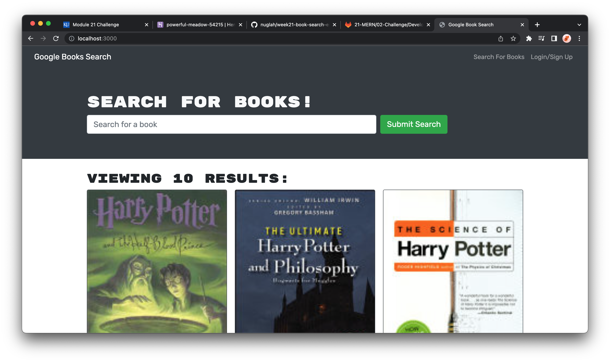

# Book-Search-Engine

## Description

A search engine that uses the Google books api to earch for books. The starter code was using a restful api. It has been chnaged to use the Apolloserver and GraphQL api.

## Installation

Deployed to heroku
https://nuglah.github.io/week20-react-portfolio/#/about

## Usage

Searching for a book or author will display the result on the page.

